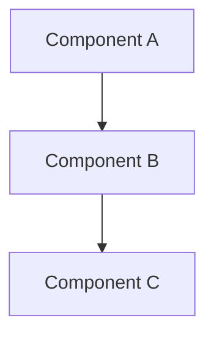

# Obsidian Note Template

Use this template when generating the Obsidian note output. Load the obsidian-markdown skill before writing.

## Frontmatter Schema

All fields are required unless marked optional. Values come from the verified fact sheet only.

```yaml
---
title: "{Repo Name}"
created: YYYY-MM-DD
modified: YYYY-MM-DD
tags:
  - github-intel
  - github/{owner}
  - lang/{primary-language}
  - topic/{domain}
type: github-intel
disposition: reference
source:
  repo_url: "https://github.com/{owner}/{repo}"
  visibility: public
  license: "{license or 'None'}"
  stars: 0
  forks: 0
  last_commit: "YYYY-MM-DD"
  first_commit: "YYYY-MM-DD"
  total_commits: 0
  primary_language: "{language}"
  analysis_date: "YYYY-MM-DD"
maintainers:
  - name: "{from git log}"
    github: "{username}"
    company: "{from gh api, optional}"
    blog: "{from gh api, optional}"
    linkedin: "{from web search, optional}"
    twitter: "{from gh api or web search, optional}"
tech_stack:
  - "{language/framework}"
aliases:
  - "{owner}/{repo}"
---
```

## Body Structure

```markdown
# {Repo Name}

> [!info] Repository Overview
> {One-paragraph description from README or gh api description}
> - **URL**: [GitHub]({repo_url})
> - **Stars**: {stars} | **Forks**: {forks} | **Commits**: {total}
> - **Active**: {first_commit} → {last_commit}

## Architecture

> [!abstract] System Design
> {2-3 sentence architecture summary}



## Technology Stack

| Category | Technology | Evidence |
|----------|-----------|----------|
| Language | {lang} | {file:line} |
| Framework | {framework} | {file:line} |
| Database | {db} | {file:line} |

## Key Files

| File | Purpose |
|------|---------|
| `{path}` | {description} |

## Maintainer

> [!tip] {Maintainer Name}
> **Role**: {role} at {company}
> **GitHub**: [@{username}](https://github.com/{username})
> **LinkedIn**: [{display}]({linkedin_url})

## Activity Timeline

| Date | Event |
|------|-------|
| {date} | {milestone} |

## Assessment

> [!note] Key Takeaways
> - {takeaway 1}
> - {takeaway 2}
> - {takeaway 3}

## Related

- [[{Related Note 1}]]
- [[{Related Note 2}]]
```

## Rules

1. **Mermaid in Obsidian** — use fenced code blocks with ```mermaid, not HTML
2. **graph TD only** — no `flowchart` keyword (Obsidian rendering issues)
3. **Short labels** — no HTML, no special chars, single line
4. **Wikilinks** — use `[[Note Name]]` for linking to other vault notes
5. **Callouts** — use `> [!type]` syntax (info, tip, warning, note, abstract)
6. **Tags** — nested tags use `/` separator (e.g., `github/leojacinto`)
7. **Dates** — always ISO 8601 format (YYYY-MM-DD)
8. **No fabrication** — every value must come from the fact sheet
